Svn日志管理

背景
====

公司的项目比较多，代码管理工具用的是svn，管理者有下列需求：

1.  查看各个项目当前的开发情况，包括多少人正在开发哪些项目，查看某个员工最近在开发哪些项目，提交情况，检查代码质量等；

2.  代码提交后，需要自动发布到测试服务器；

技术
====

需要把svn的日志增量同步到数据库，同步频率控制在5分钟一次，由于sharpsvn的类库不支持dotnet
core版本，只好采用的是用vs2010开发windows服务；前端用vs code 2017
开发vue；后端用vs 2017开发dotnet core
webApi，在linux下部署，自动发布用持续集成特性的jenkins部署，后端调用jenkins的api实现自动发布。

同步Svn日志
===========

>   每次读上次同步到哪个版本，调用sharpSvn的类库，读取日志实现增量更新

前端
====

在vue-admin-template的基础上快速开发，使用了vue全家桶、ElementUI、axios、\@riophae/vue-treeselect、babel-polyfill等。

代码打包后放到linux上，用nginx负载均衡。

Api
===

>   基于Dotnet Core开发的WebApi，使用Dapper、Swagger等技术，docker
>   私有仓库，容器化部署，jenkins持续集成（获取代码，编译，推到仓库，测试服务器拉取镜像，运行容器），调用jenkins
>   api实现一键发布。

6 注意
======

项目里的数据库链接字符串，svn账号，项目的svn地址等请根据自己的情况修改

7效果图
=======

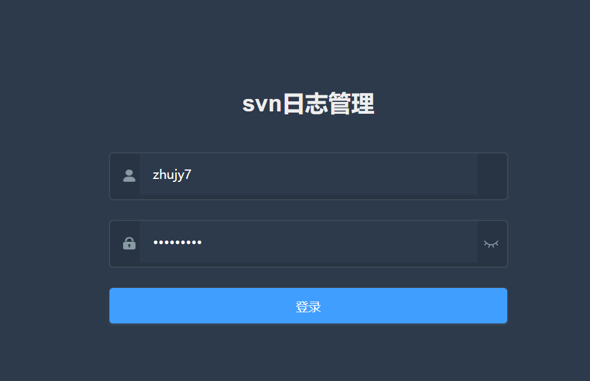

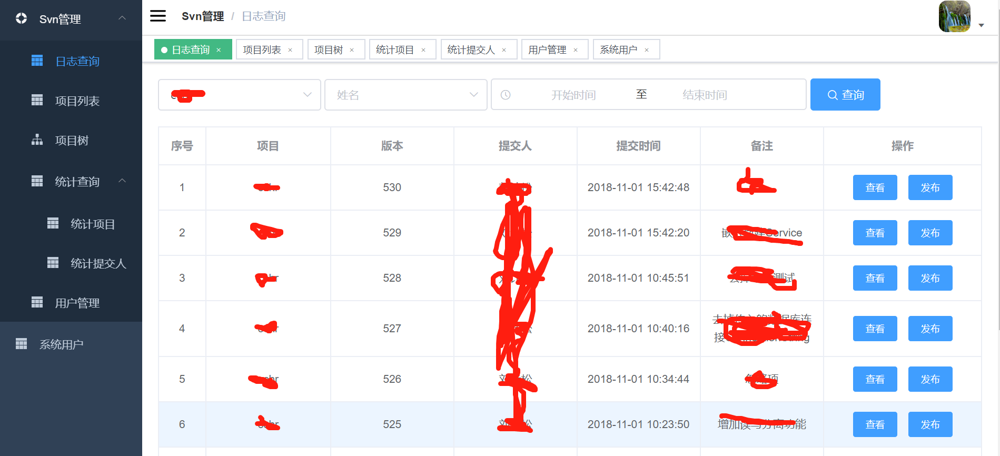

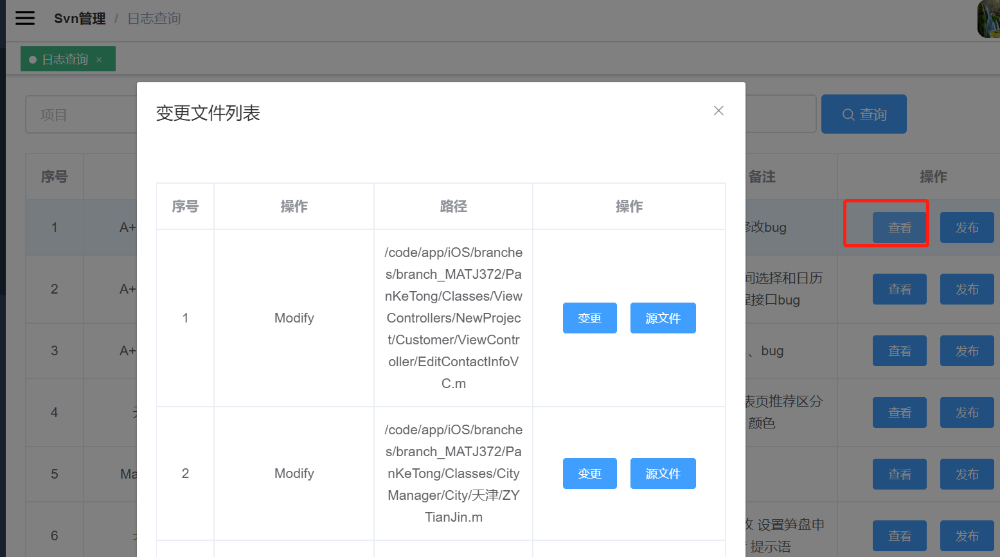

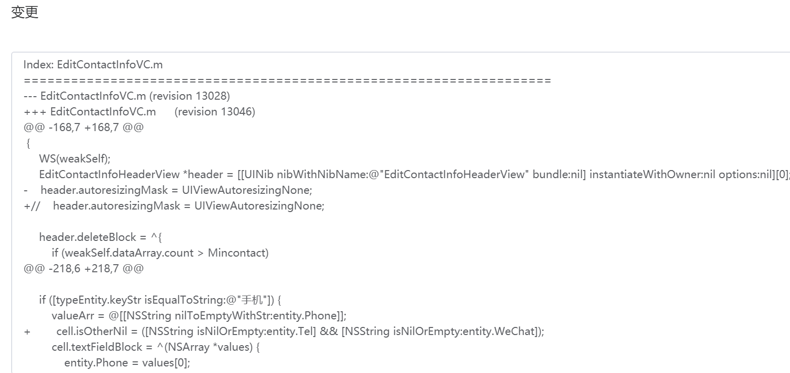

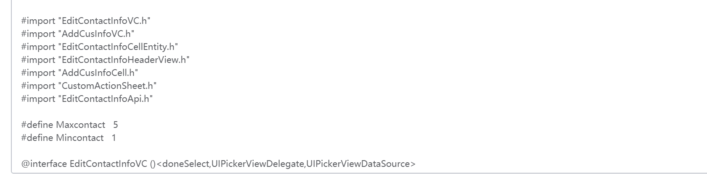

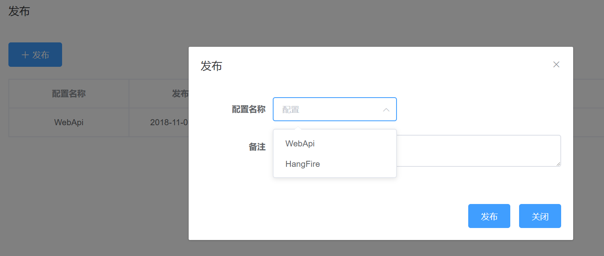

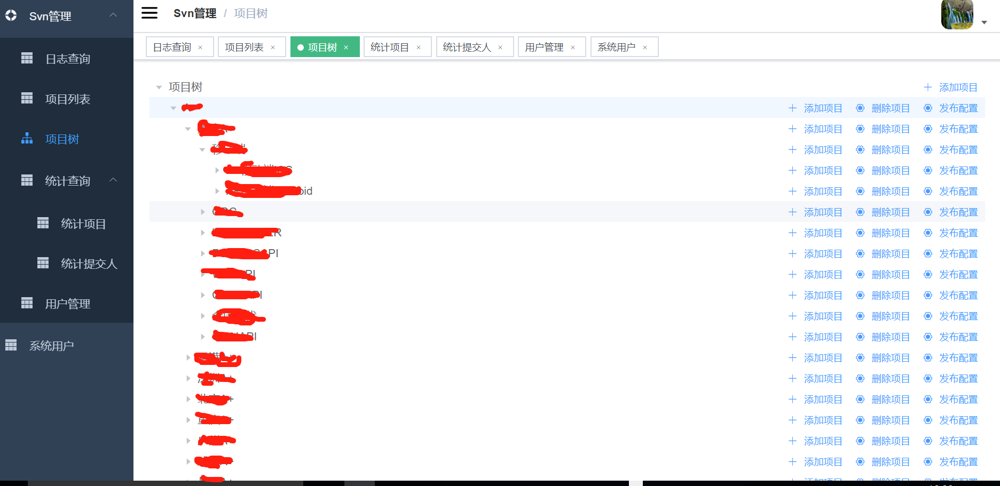

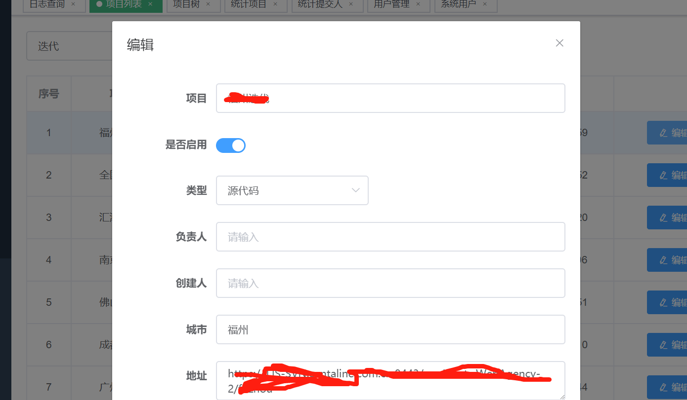

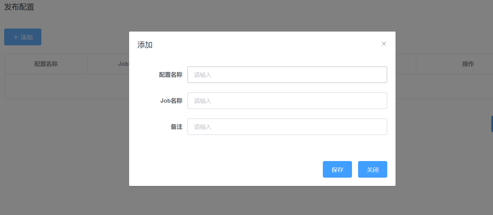

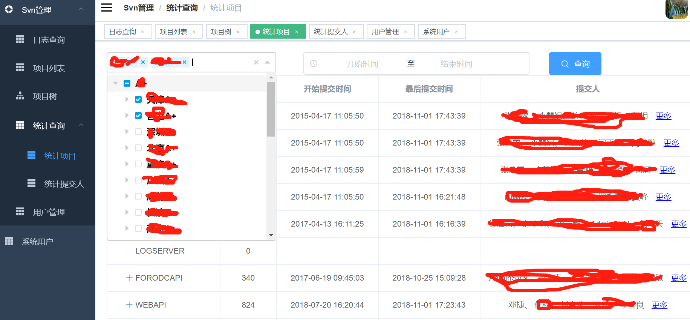

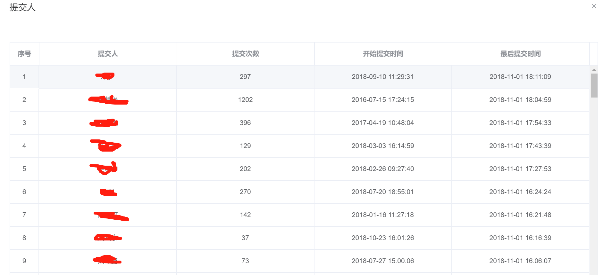

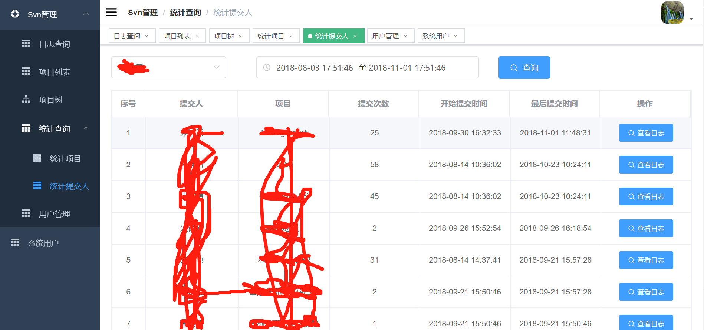

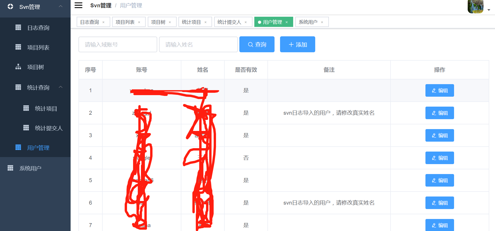

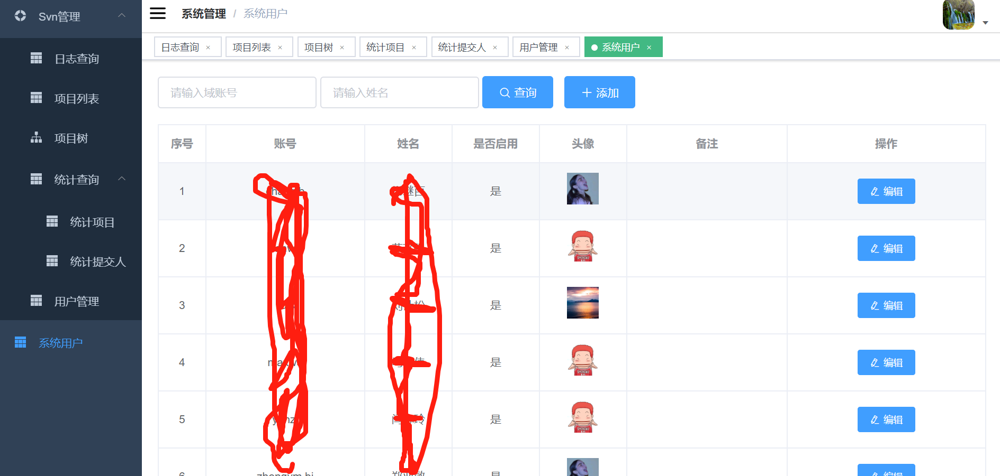
